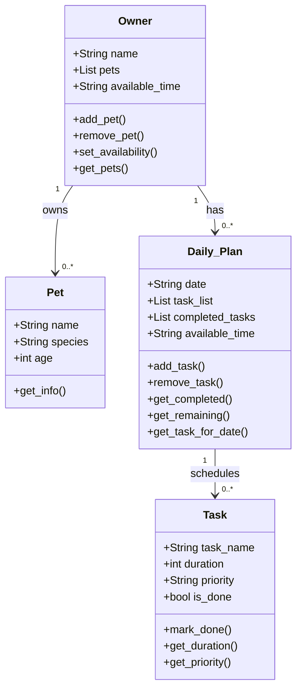

# PawPal+ Class Diagram

```mermaid
classDiagram
    class Owner {
        +String name
        +List pets
        +String available_time
        +add_pet()
        +remove_pet()
        +set_availability()
        +get_pets()
    }

    class Pet {
        +String name
        +String species
        +int age
        +get_info()
    }

    class Task {
        +String task_name
        +int duration
        +String priority
        +bool is_done
        +mark_done()
        +get_duration()
        +get_priority()
    }

    class Daily_Plan {
        +String date
        +List task_list
        +List completed_tasks
        +String available_time
        +add_task()
        +remove_task()
        +get_completed()
        +get_remaining()
        +get_task_for_date()
    }

    Owner "1" --> "0..*" Pet : owns
    Owner "1" --> "0..*" Daily_Plan : has
    Daily_Plan "1" --> "0..*" Task : schedules
```
